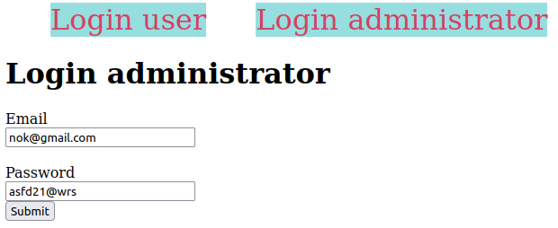
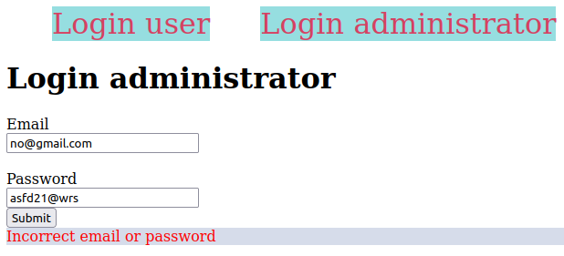
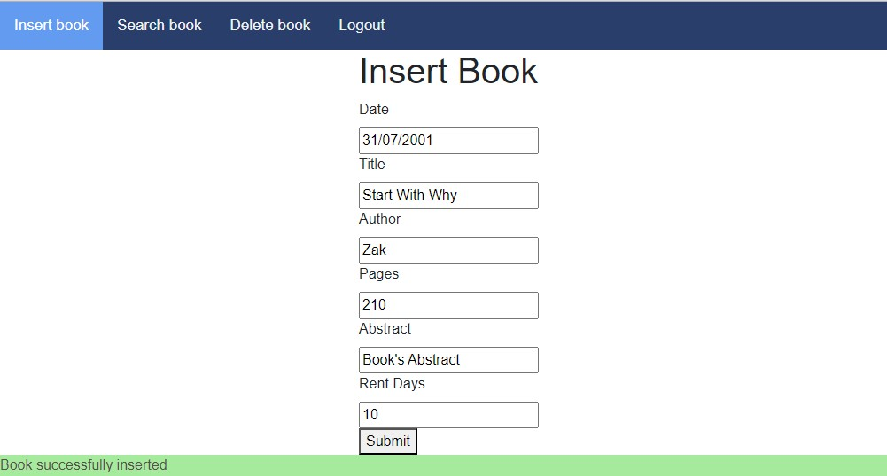
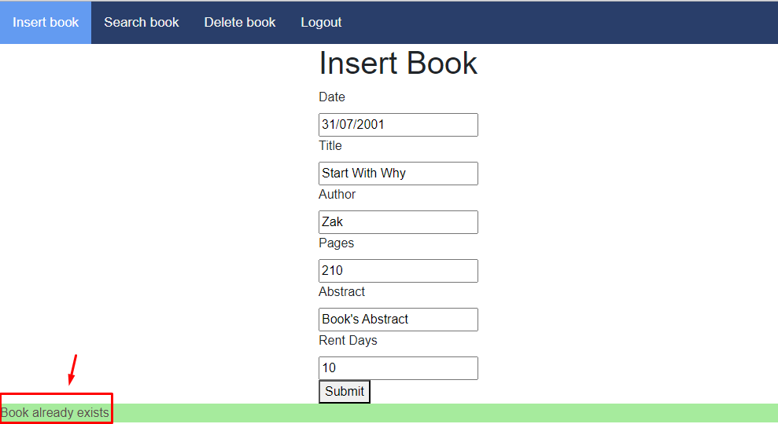
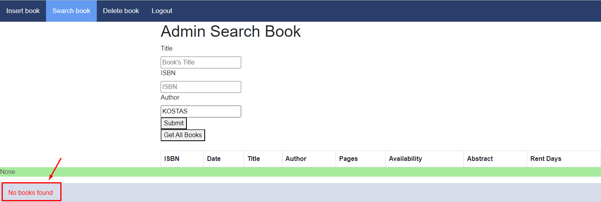
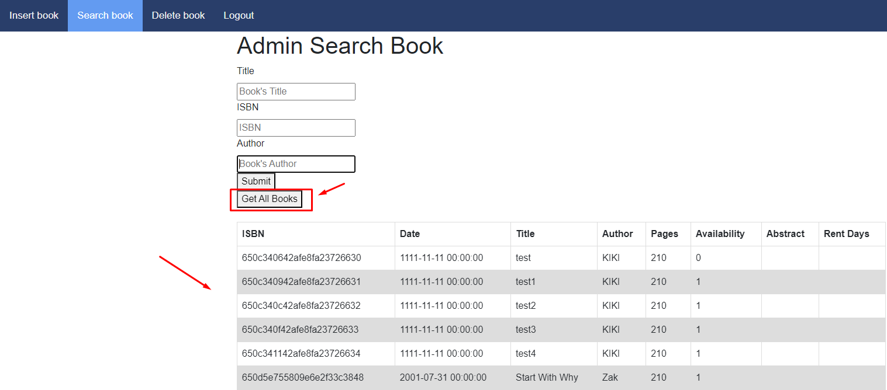
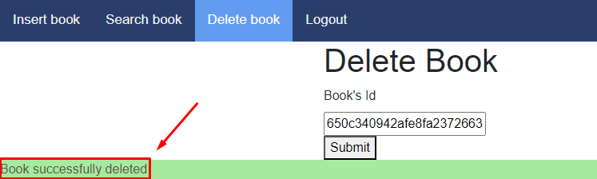

# Administrators's endpoints

```text
- /                             Choose the type of user
- /admin/loginAdmin             Login an administrator to the system (hard coded credentials)
- /admin/insertBook             Insert a new book into the database
- /admin/deleteBook             Delete an existing book from the database
- /admin/adminSearchBook        Searching for books in the database    
- /admin/logout                 Logout the administrator from the system
```

## index (/)

The home (root) page of the web app redirects the user to the login page of the user type they want. This endpoint uses a GET request to redirect the user to _**/loginAdmin**_ or _**/login**_

## login administrator (/loginAdmin)

The login of an administrator to have access to the system. This endpoint uses a POST request with parameters: _"email"_ and _"password"_.
After the POST request occurs the input parameters will be checked for their validity. If an administrator exists then he will redirect to _**/insertBook**_.

|  |
| :--------------------------------------------------------------: |
|                     _Endpoint: /loginAdmin_                      |

Using the credential above the administrator can login successfully.

After a successful request the administrator will be redirected in endpoint "/insertBook" as shown below:

|  |
| :-----------------------------------------------------------------------: |
|                         _Endpoint: /insertBook_                         |

After failed request (wrong email) will be shown an error message as presented in the image below:

|  |
| :-------------------------------------------------------------------------: |
|                          _ Endpoint: /loginAdmin_                           |


## Insert new book (/insertBook)

This page is used for inserting a new book into the database. It contains a form to create a POST request with parameters:_"date"_, _"title"_, _"author"_, _"pages"_, _"abstract"_ and _"rent days"_. After submitting this request, will be checked if this book exists in the database. In case that does not exist te bok ith inserted details will be added to the database and a success message will be printed. On the other hand, an error message will be printed.

The picture below depicts the successful insertion of a new book into the system.

|  |
| :-----------------------------------------------------------------------------------: |
|                          _Endpoint(success): /insertBook_                           |

On the other hand, if this process will fail the following message will be printed.

|  |
| :-----------------------------------------------------------------------------: |
|                         _Endpoint(fail): /insertBook_                         |

## Search existing book (/adminSearchBook)

Using this endpoint an administrator could search for an existing book. To do that user should fill up a form that creates a POST request with parameters _"title"_, _"ISBN"_ and "_author_". If there are books for the specified POST request then all of them will be shown on the screen. On the other hand, a "no books exists" message will be printed. 
Also if the admin does not want to search a book with a specific parameter he can press the button "Get All Books" and then he will get all books from the database.

The images below show two of the cases (success, fail) described above.

|  |
| :-----------------------------------------------------------------------------------: |
|                          _Endpoint(success): /adminSearchBook_                          |

|  |
| :--------------------------------------------------------------------------------: |
|                          _Endpoint(fail): /adminSearchBook_                           |

|  |
| :--------------------------------------------------------------------------------: |
|                          _Endpoint(success): /adminSearchBook_                           |

## Delete existing book (/deleteBook)

On this page an administrator has the ability to delete an existing book using it's ISBN (unique id). To do that should fullfil a form with the Book's Id. This form will create a POST request with parameter: _"bookId"_. If the delete proccess have been succeed then a success message will be shown, else an error one.

The images below show two of the cases (success, fail) described above.

|  |
| :----------------------------------------------------------------------------------: |
|                          _Endpoint(success): /deleteBook_                          |

|  |
| :--------------------------------------------------------------------------------: |
|                          _Endpoint(fail): /deleteBook_                           |
