# User's endpoints

```text
- /                                      Choose the type of user
- /user/login                            Login a User to the system
- /user/registerUser                     Register a User to the system
- /user/searchBook                       Search for book with specified criteria
- /user/rentBook                         Rent a book from the available ones
- /user/viewBookings                     View bookings with booking number
- /user/returnBook                       Return book with booking number
- /user/deactivateAccount                Delete User's account
- /user/logout                           Logout the user from the system
```

## Login user (/user/login)

The login of a user to have access to the system's functionalities. This endpoint uses a POST request with parameters: _"email"_ or _"username"_ and _"password"_. After the POST request occurs the input parameters will be checked for their validity. If this user exists then he will redirect to _**/user/searchBook**_.

In the image below be presented the login user process with success. After successful login, the user is redirected to the /searchBook endpoint.

| 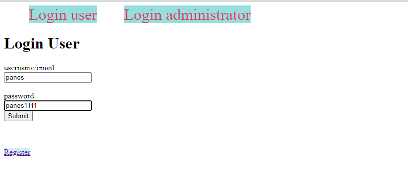 |
| :------------------------------------------------------------: |
|                  _Endpoint(success): /login_                   |

In case the login process had failed then an error message will be printed.

| 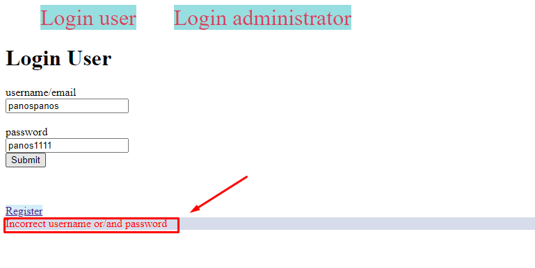 |
| :-----------------------------------------------------------------------: |
|                         _Endpoint(fail): /login_                          |

## Register a user (/user/registerUser)

The purpose of this page is the insertion of a new user into the system. This page contains a form that creates a POST request with parameters: _"username"_, _"email"_, _"password"_, _"first name"_, _"last name"_, _"date of birth"_. If the inserted user does not exist in the database then his credential will be added to the database and a success message will be printed. On the other hand, an error message will be shown on the screen.

In the image below will be presented the described process. After successful registration, a user will be redirected to the /searchBook endpoint.

| 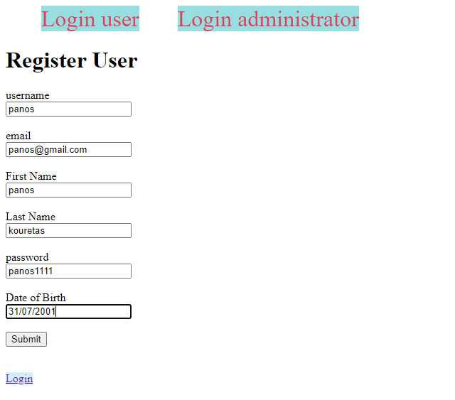 |
| :------------------------------------------------------------------: |
|                      _Endpoint: /registerUser_                       |

| 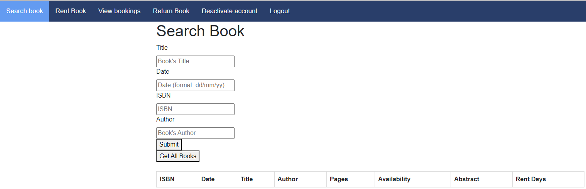 |
| :------------------------------------------------------------------: |
|                      _Endpoint: /searchBook_                       |

In case the registration process had been failed then an error message will be printed.

| 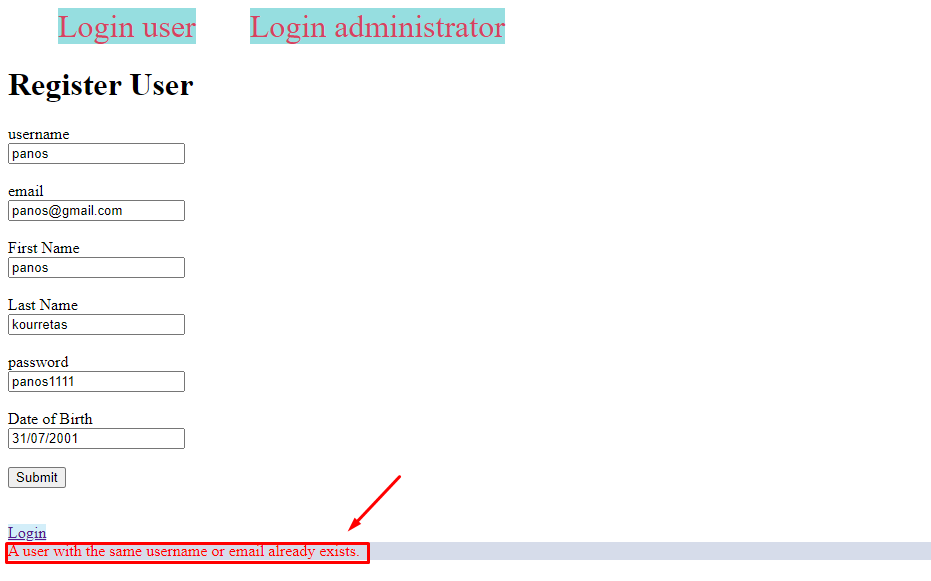 |
| :-----------------------------------------------------------------------------: |
|                         _Endpoint(fail): /registerUser_                         |

## Search a book (/user/searchBook)

Using this endpoint a user has the opportunity to search a book based on the title or date published or ISBN or author. To do that user should fill up one of these parameters in the form that creates a POST request with parameters _"title"_, _"date"_, "_isbn"_, _"author"_. If there are books for the specified POST request then all of them will be shown on the screen. On the other hand, a "no book exists" message will be printed. Also if the user does not want to search a book with a specific parameter he can press the button "Get All Books" and then he will get all books from the database.

The images below represent the scenario described above.

| 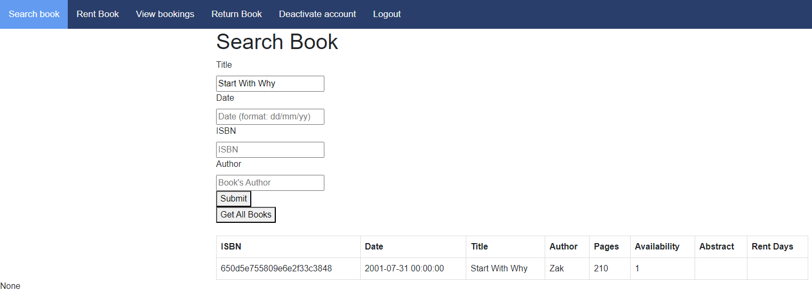 |
| :-----------------------------------------------------------------------------------: |
|                          _Endpoint(success): /searchBook_                           |

|  |
| :-----------------------------------------------------------------------------: |
|                        _Endpoint (fail): /searchBook_                         |

| 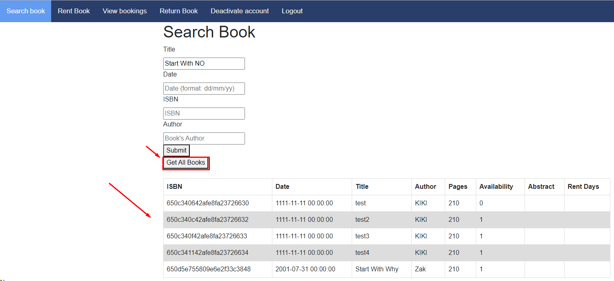 |
| :-----------------------------------------------------------------------------------: |
|                          _Endpoint(success): /searchBook_                           |

## Rent a Book (/user/rentBook)

If a user needs to rent a book should visit this endpoint and type the desired book that wants to make a reservation. To succeed that he should fill up and submit the form which creates a POST request with parameters _"ISBN"_, _"name"_, _"surname"_ and _"phone"_. After the form's submission will be completed the will be printed the booking. In another case, an error message will be printed.

In the first image below the logged-in user could rent a book with success.

| 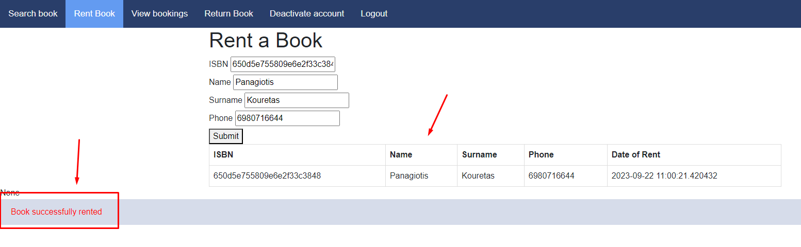 |
| :-------------------------------------------------------------------------------: |
|                       _Endpoint (success): /rentBook_                        |

The image below shows a fail scenario with the wrong book isbn.

| 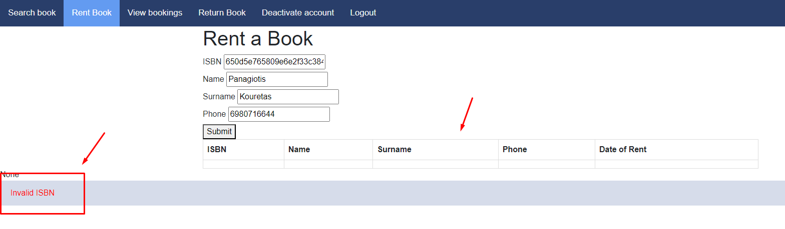 |
| :-------------------------------------------------------------------------: |
|                      _Endpoint (fail): /rentBook_                      |

## View bookings (/viewBookings)

On this page, a logged-in user can see all his rented books. Is he has made no booking yet, then he will get the appropriate message.

In the first image below the logged-in user could view all rented books (success scenario).

|  |
| :----------------------------------------------------------------------------------------------------------: |
|                                  _Endpoint (success): /viewBookings_                                   |

In the image below shown a fail scenario with wrong "ordering" input.

| 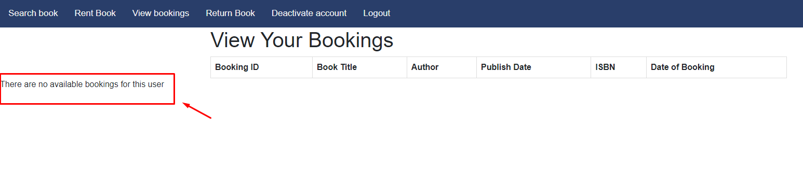 |
| :-------------------------------------------------------------------------------------------------------: |
|                                  _Endpoint (fail): /viewBookings_                                   |


## Return a Book (/returnBook)

In this domain, a user can return his book with just filling up the form with the bookings unique Id. This form creates a POST request with only one parameter: _"booking ID"_. If booking with inserted booking ID exists then a success message will be returned. In other case a fail message will be printed.

In the first image below the logged-in user could return a book with success.

|  |
| :-------------------------------------------------------------------------------------------: |
|                             _Endpoint (success): /returnBook_                              |

And as you can see in the image below, there are no bookings on the View bookings tab after the user returned the book he rented.

|  |
| :----------------------------------------------------------------------------------------: |
|                             _Endpoint (success): /viewBookings_                              |


## Delete user's account (/deactivateAccount)

The purpose of this endpoint is to allow a user to delete his/her account if they want. If the user presses the deactivate button then his account will be deleted from the system.

| 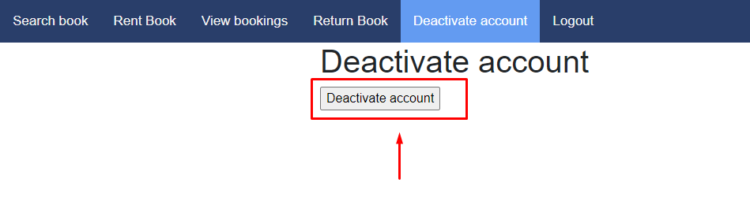 |
| :----------------------------------------------------------------------------: |
|                    Endpoint (success): /deactivateAccount\_                    |

And as you can see in the image below the user that he deleted his account can't still sign in the system. If he wants to though, he has to register for a new account.

| 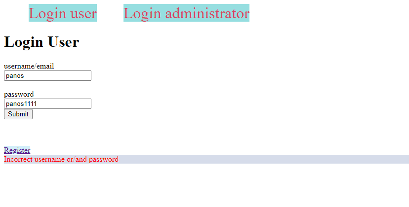 |
| :----------------------------------------------------------------------------: |
|                    Endpoint (success): /deactivateAccount\_                    |